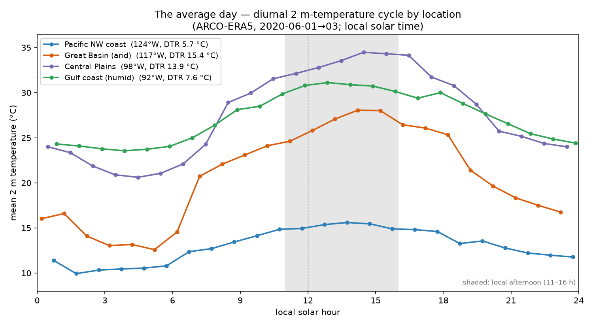
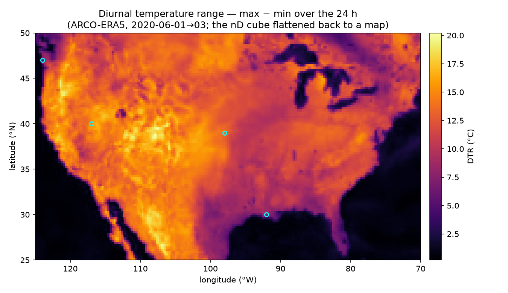
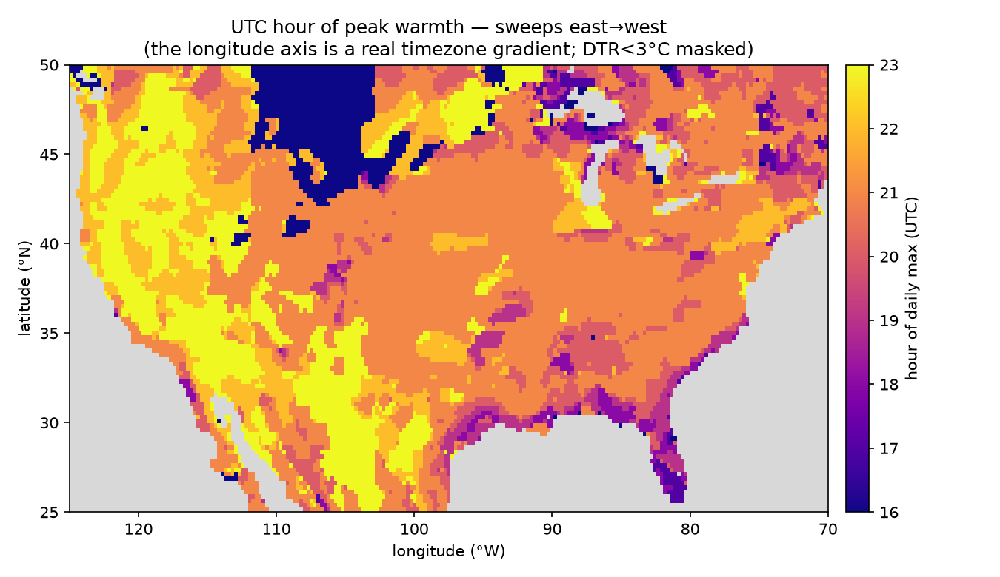

# Climatology cookbook — gridded normals via SQL

Builds temperature **climatologies** from ARCO-ERA5 with a single SQL query.
Three variants:

| file | scope | output rows | cost |
|------|-------|------------|------|
| [`diurnal_climatology.sql`](diurnal_climatology.sql) | CONUS box, hour-of-day cycle, 3-day window | 101 × 221 × 24 = **535 K** | ~300 MB (72 timesteps) |
| [`city_climatology.sql`](city_climatology.sql) | 10 largest cities, nearest grid cell | 10 × 12 = **120** | ~1–2 GB (mid-month sample) |
| [`monthly_climatology.sql`](monthly_climatology.sql) | whole 0.25° grid, **all** timesteps | 12 × 721 × 1440 = **12.4 M** | hundreds of GB–~1 TB (stress test) |

All use the same `era5` GCS table and the same dict-encoding `arrow_cast`
gotchas. The two *monthly* variants use the WMO 1991–2020 base period; the
diurnal variant instead groups by hour-of-day over a short bounded window.

## Diurnal variant (cheapest — start here)

`diurnal_climatology.sql` is the canonical **"a climatology is a `GROUP BY`, not
a rechunk"** workload: `GROUP BY latitude, longitude, hour` with `AVG` — exactly
`da.groupby("time.hour").mean()`, but the `WHERE` prunes a multi-decade archive
down to a 72-timestep window so you pay only for the slice you ask for. It mirrors
[xarray-sql's `02_climatology.py`](https://github.com/xqlsystems/xarray-sql/blob/main/benchmarks/geospatial/02_climatology.py)
benchmark. `hour` is derived in the `GROUP BY` (after the read), not a filter, so
all three coordinate predicates stay contiguous ranges — no scattered-`Indices`
conflict. Widen the date range for a seasonal diurnal normal; the row count is
fixed by grid × 24.

## City variant (start here)

`city_climatology.sql` computes a monthly normal for each of the 10 largest
urban agglomerations using an **in-query `VALUES` lookup table**.

### Nearest-cell snapping (why the join is exact equality)

A city centroid almost never lands on the 0.25° grid, and the Zarr filter
pushdown matches coordinates by **exact equality** — it has no nearest-neighbour
mode (see `src/reader/filter.rs`). So we pre-snap each centroid to its nearest
grid point *in the lookup table*:

```
glat = round(lat / 0.25) * 0.25
glon = round(((lon + 360) mod 360) / 0.25) * 0.25    # ERA5 lon is 0–360
```

Multiples of 0.25° are exact in f32/f64, so `g.lat = c.glat AND g.lon = c.glon`
is a safe exact-equality join and the `IN`-lists push down cleanly. To change the
city list, recompute the `glat/glon` literals:

```bash
python3 - <<'PY'
cities = [("Tokyo", 35.6895, 139.6917), ...]   # name, lat, lon
snap = lambda v: round(v*4)/4
for n,la,lo in cities:
    print(n, snap(la), snap(lo % 360))
PY
```

### Cities don't reduce I/O here (important)

ARCO-ERA5 stores **one timestep per chunk over the full lat×lon plane**, so a
spatial filter does *not* cut chunk reads — only the time predicate does.
Restricting to 10 cities costs the same I/O as the whole grid; it only shrinks
the output and the group-by. That's why the city query keeps the **mid-month
sample** (noon on the 15th, averaged across 30 years → 360 planes). Dropping the
`day`/`hour` predicates turns it into the full ~1 TB stress test.

## Whole-grid stress variant

`monthly_climatology.sql` removes all sub-sampling: every hourly timestep in the
base period contributes to each cell's mean (~262,800 chunk reads). It exists to
push the reader/aggregation path at full scale. Bound a trial by narrowing the
year range and/or uncommenting the spatial sub-grid `BETWEEN`.

## Run

```bash
zarr-cli cookbook/climatology/diurnal_climatology.sql   # 535K rows — redirect to a file
zarr-cli cookbook/climatology/city_climatology.sql      # 120 rows
zarr-cli cookbook/climatology/monthly_climatology.sql   # 12.4M rows — redirect to a file
```

## Plots (diurnal variant)

`plots.py` turns the 535 K-row diurnal result into three figures. It reads the
**frozen** recipe output `diurnal_climatology.csv.gz` (the committed result of
`diurnal_climatology.sql`), so it is fully offline — **no remote scan**. To
refresh the CSV, wrap the query in a CSV `COPY` (see *Writing results* below) and
gzip it.

```bash
uv run --with pandas --with numpy --with matplotlib \
    cookbook/climatology/plots.py
```

### 1. The average day — `diurnal_cycles.png`



Mean 2 m temperature vs **local solar hour** at four contrasting cells. Aligning
on solar time makes every cycle peak near local afternoon, so only the
**amplitude** differs — and that difference is the physics: the arid Great Basin
swings ~15 °C between night and afternoon, while the marine Pacific-NW coast
barely moves (~5 °C). This is what `GROUP BY lat, lon, hour` *is*.

### 2. Diurnal temperature range — `diurnal_range_map.png`



Per-cell `max − min` over the 24 hours, i.e. the nD cube flattened straight back
to a map. The North American **coastline draws itself** — dark, low-range ocean
vs bright, high-range land — with the Great Lakes and Gulf of Mexico clearly
resolved. Nothing here knows about geography; the land/sea contrast falls out of
the diurnal range alone. Cyan rings mark the four cells from plot 1.

### 3. Hour of peak warmth — `peak_hour_map.png`



The **UTC** hour of each cell's daily maximum. It sweeps later from east to west
(east coast peaks ~20 UTC, west coast ~23 UTC) — a timezone gradient emerging
purely from the data, proof the longitude axis is real. Ocean cells (where the
flat cycle makes "hour of max" meaningless noise) are masked by a diurnal-range
floor.

## Writing results to Parquet

No code change needed — DataFusion 54 supports Parquet writes natively. Wrap the
final `SELECT` (drop `ORDER BY` for the write):

```sql
COPY ( <the WITH ... SELECT ... GROUP BY ...> )
TO 'cookbook/climatology/city_climatology_1991_2020.parquet'
STORED AS PARQUET;
```

Same shape for CSV — this is how `diurnal_climatology.csv.gz` (the input to
`plots.py`) is produced; drop `ORDER BY`, write CSV, then `gzip`:

```sql
COPY ( <the diurnal WITH ... SELECT ... GROUP BY ...> )
TO 'cookbook/climatology/diurnal_climatology.csv'
STORED AS CSV;
```

## Validating the normals

Each value is a **grid-cell** number, so compare references the right way:

- **Pipeline consistency:** diff against ERA5 monthly-mean products
  (WeatherBench 2 / CDS monthly) — should match to rounding.
- **Physical truth:** diff each city against **station normals** (NOAA NCEI
  1991–2020 CSV, or Meteostat `Normals` for global cities). Expect legitimate
  station-vs-cell offsets (~1–2 °C, more on coasts/terrain) and the
  (Tmax+Tmin)/2 vs true-mean gap — not bugs.
