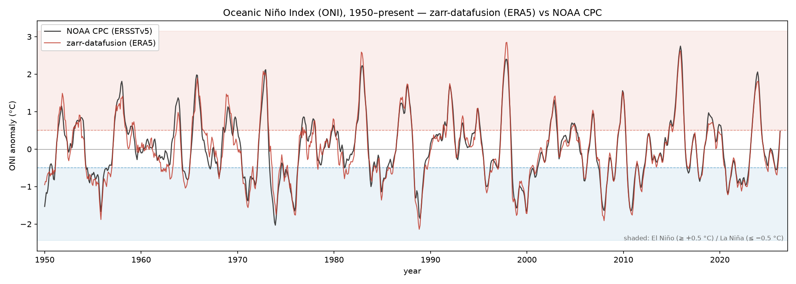
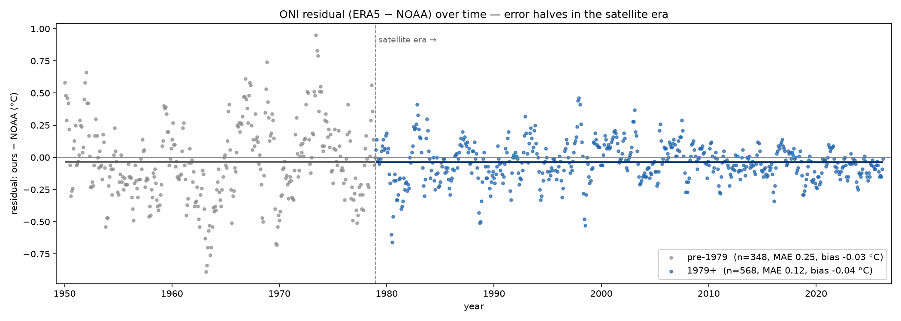

# El Niño / La Niña — ONI from ERA5 with SQL, validated against NOAA

Compute the **Oceanic Niño Index (ONI)** — the headline ENSO indicator — for every
overlapping 3-month season from **1950 to present**, directly over public ERA5
sea-surface-temperature data using a single SQL query through `zarr-datafusion`,
then validate it against NOAA CPC's official ONI table.

**Headline result (916 seasons, 1950–2026, vs NOAA CPC):**

| | |
|---|---|
| MAE (anomaly) | **0.17 °C** overall · **0.12 °C** in the satellite era (1979+) |
| Pearson r | **0.966** |
| Mean bias | **−0.04 °C** (negligible — essentially unbiased) |
| ENSO-phase agreement | **quadratic-weighted κ = 0.88**, with **zero La Niña↔El Niño sign flips** |

The residual gap is fully explained by dataset differences (ERA5 vs NOAA's ERSSTv5),
a single-sample monthly proxy, and pre-satellite (pre-~1965) reanalysis uncertainty.



The two series track tightly across every major ENSO event — the big El Niños
(1982-83, 1997-98, 2015-16) and La Niñas all line up, visualising the r = 0.966.

---

## Files

| File | What it is |
|------|-----------|
| `oni_all_seasons.sql` | The query: ONI + ENSO phase per season, 1950→now, over ARCO-ERA5 on GCS |
| `oni_compare.py` | Comparison script: our values vs NOAA, regression + classification metrics |
| `oni_noaa_reference.txt` | Vendored NOAA CPC reference (`oni.ascii.txt`, `SEAS YR TOTAL ANOM`) |
| `oni_computed.txt` | Our 917-season output (raw `zarr-cli` table dump) |
| `oni_comparison.csv` | Per-season merged comparison with residuals and both classes |
| `plots.py` | Renders the figures below from `oni_comparison.csv` (offline) |
| `oni_timeseries.png`, `oni_residual.png` | Generated figures |

---

## What ONI is, and how the query computes it

ONI = **3-month running mean of monthly SST anomalies** in the **Niño-3.4 box**
(5°S–5°N, 170°W–120°W → longitude 190–240 in 0–360°), where the anomaly is the
departure from NOAA's **centred, rolling 30-year monthly climatology** (see
*Climatology: a rolling base period* below).

`oni_all_seasons.sql` does this end to end:

1. **Sample** one value per month (noon of the 15th) inside the Niño-3.4 box —
   `WHERE` touches **coordinates only** (`latitude`, `longitude`, and `time` via
   `extract()`), so the engine pushes the selection into the scan.
2. **Monthly spatial mean** per `(year, month)`; NaN fill from absent chunks is
   dropped post-aggregate with `HAVING`.
3. **Climatology** = per-month mean over the season's rolling 30-year base period.
4. **Anomaly** on a contiguous month index `t = yr*12 + (mo-1)`.
5. **ONI** = centred 3-month moving average via a self-join on `t-1, t, t+1`
   (all three must exist), so one row is emitted per centre month → DJF…NDJ.
6. **ENSO phase** from the ±0.5 °C thresholds:
   `≥ +0.5 → El Niño`, `≤ −0.5 → La Niña`, else `Neutral`.

Season labelling follows NOAA's **centre-month-year** convention
(DJF 1998 = Dec 1997, Jan 1998, Feb 1998).

### Climatology: a rolling base period

The anomaly is **not** taken against one fixed window. Each season uses NOAA CPC's
**centred 30-year base period that shifts forward every 5 years**, held at the
latest complete 30-year period (currently 1991–2020) for recent seasons:

| ONI season-years | 30-yr base period | | ONI season-years | 30-yr base period |
|---|---|---|---|---|
| 1950–1955 | 1936–1965 | | 1981–1985 | 1966–1995 |
| 1956–1960 | 1941–1970 | | 1986–1990 | 1971–2000 |
| 1961–1965 | 1946–1975 | | 1991–1995 | 1976–2005 |
| 1966–1970 | 1951–1980 | | 1996–2000 | 1981–2010 |
| 1971–1975 | 1956–1985 | | 2001–2005 | 1986–2015 |
| 1976–1980 | 1961–1990 | | 2006–now  | 1991–2020 |

In the SQL this is a `base_periods(yr_lo, yr_hi, base_lo, base_hi)` lookup table:
a month's year range-joins to exactly one block, the per-block per-month
climatology is computed over that block's 30-year window, and the anomaly is taken
against it.

**Why it matters.** A naïve single fixed 1991–2020 base measures deep-past SSTs
against a modern-warm mean, injecting a spurious **−0.21 °C cold bias before 1991**
and a false changepoint sitting exactly on the base-window edge at 1991. Moving the
base with the data removes both — overall MAE drops **0.21 → 0.17 °C**, bias
**−0.14 → −0.04 °C**, and the 1991 artifact disappears (the only remaining residual
break is ~1965, attributable to ERA5 itself; see Caveats).

---

## Reproduce

**1 — produce our values** (remote scan of public ARCO-ERA5; ~60 s on a
same-region GCP VM, ~25–35 min over a home connection — the rolling base needs the
record back to 1940):

```bash
zarr-cli cookbook/el-nino-oni/oni_all_seasons.sql > cookbook/el-nino-oni/oni_computed.txt
```

**2 — compare against NOAA** (offline, using the vendored reference):

```bash
uv run --with requests --with pandas --with numpy --with scikit-learn \
       --with scipy --with tabulate \
  scripts/oni_compare.py \
    --computed  cookbook/el-nino-oni/oni_computed.txt \
    --reference cookbook/el-nino-oni/oni_noaa_reference.txt \
    --out       cookbook/el-nino-oni/oni_comparison.csv
```

(Drop `--reference` to fetch the latest NOAA table live instead of the vendored copy.
`oni_compare.py` here is a copy of `scripts/oni_compare.py`.)

**3 — regenerate the figures** (offline, from `oni_comparison.csv`):

```bash
uv run --with pandas --with matplotlib cookbook/el-nino-oni/plots.py
```

---

## Which metrics, and why

The two comparisons are different problems and need different metrics:

**Raw anomalies (continuous, °C):** **MAE** (interpretable), **mean error / bias**
(separates a systematic offset from scatter — important since NOAA is ERSSTv5, not
ERA5), and **Pearson r** (phase agreement). RMSE/R² secondary.

**ENSO class (3 ordinal classes):** the headline is **quadratic-weighted Cohen's κ**,
because the classes are ordered (La Niña < Neutral < El Niño) so a sign flip must be
penalised far more than a boundary slip, and κ corrects for chance under the heavy
Neutral imbalance. Report the **confusion matrix** + **macro-F1**; **do not** lead with
accuracy (Neutral dominates and inflates it).

---

## Findings

### Raw anomalies (regression)

| Metric | Value |
|--------|-------|
| N | 916 seasons |
| MAE | 0.17 °C |
| RMSE | 0.22 °C |
| Mean error (bias) | −0.04 °C (essentially unbiased) |
| MAE after de-bias | 0.16 °C |
| Pearson r | 0.966 |
| R² | 0.927 |

**The satellite-era split is the key result:**

| Era | N | MAE | bias |
|-----|---|-----|------|
| pre-1979 | 348 | 0.25 | −0.03 |
| 1979+ | 568 | **0.12** | −0.04 |

Error roughly halves at 1979 — ERA5 gains satellite constraint over the tropical
Pacific. Post-1979 MAE (0.12 °C) is at the expected ERA5-vs-ERSSTv5 floor. Note the
bias is **flat and near-zero across the split** (−0.03 vs −0.04): with the rolling
base period there is no systematic offset to remove, so the satellite era is now
purely a **scatter/precision** improvement, not a bias one.



The scatter visibly collapses at the 1979 boundary while the per-era bias lines sit
together near zero — the satellite era tightens spread, and the rolling base has
already eliminated the offset.

### ENSO class

**Quadratic-weighted κ = 0.88** (“almost perfect”). Confusion matrix
(rows = NOAA truth, cols = ours):

| truth \ pred | La Niña | Neutral | El Niño |
|---|---|---|---|
| **La Niña** | 232 | 20 | 0 |
| **Neutral** | 48 | 352 | 19 |
| **El Niño** | 0 | 38 | 207 |

**Zero sign flips** — every error is a one-step boundary slip across ±0.5. That is
exactly why weighted κ (0.88) > unweighted κ (0.79) > accuracy (0.86): the
disagreements are the harmless kind.

| class | precision | recall |
|---|---|---|
| La Niña | 0.83 | 0.92 |
| Neutral | 0.86 | 0.84 |
| El Niño | 0.92 | 0.84 |

With the cold bias removed the recalls are now well balanced (La Niña 0.92, El Niño
0.84) — versus the lopsided 0.95 / 0.79 a fixed 1991–2020 base produced. A faint
residual asymmetry remains (we still slightly over-call La Niña and under-call
El Niño), but our El Niño calls stay almost always right (precision 0.92). The worst
residuals (1963, 1973 — weak, pre-satellite events) are deep-past cases.

---

## Caveats

- **Dataset:** NOAA's ONI is **ERSSTv5**; we use **ERA5**. A ~0.1–0.2 °C difference
  is expected and is most of the post-1979 error.
- **Monthly proxy:** we use a single **noon-of-the-15th** sample per month, not a true
  monthly mean — adds scatter.
- **ERA5 base-period truncation:** ARCO-ERA5's record starts in **1940**, so the
  earliest base period (1936–1965) is effectively 1940–1965 — 26 of its 30 years.
  Every later base period is fully covered. This is the one place the climatology
  cannot exactly match NOAA, and it is the most likely source of the small residual
  changepoint near ~1965.
- **Pre-~1965 / pre-1979:** ERA5 is weakly constrained over the tropical Pacific
  before the satellite era — treat the deep past with more caution. This (not the
  climatology) is now the dominant residual error.

**Cheap improvement:** sample the true monthly mean instead of noon-15th — would
shave the remaining scatter, especially in the noisier deep past.

---

## Reference

NOAA CPC — Oceanic Niño Index (ONI), ERSSTv5, centred rolling 30-year base periods:
- Table: https://www.cpc.ncep.noaa.gov/products/analysis_monitoring/ensostuff/ONI_v5.php
- Data:  https://www.cpc.ncep.noaa.gov/data/indices/oni.ascii.txt
- Base-period schedule: https://www.cpc.ncep.noaa.gov/products/analysis_monitoring/ensostuff/ONI_change.shtml

The 1979 "satellite era" split is the standard reanalysis breakpoint (TIROS-N / TOVS
operational late 1978):
- Hersbach et al. (2020), *The ERA5 global reanalysis*, QJRMS — https://rmets.onlinelibrary.wiley.com/doi/full/10.1002/qj.3803
- Bell et al. (2021), *ERA5 preliminary extension to 1950*, QJRMS (frames pre-1979 as the weaker pre-satellite back-extension) — https://rmets.onlinelibrary.wiley.com/doi/10.1002/qj.4174
