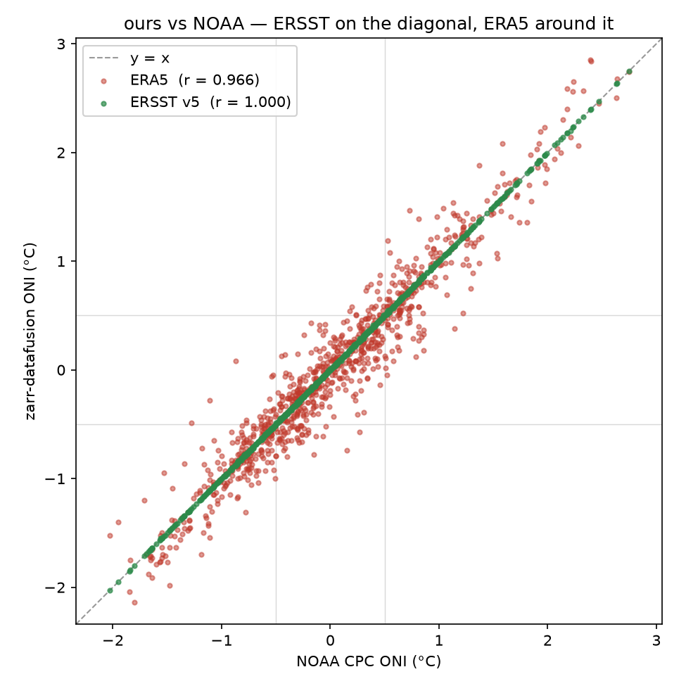

# El Niño / La Niña — ONI with SQL, two ways, validated against NOAA

Compute the **Oceanic Niño Index (ONI)** — the headline ENSO indicator — for every
overlapping 3-month season from **1950 to present**, with a single SQL query through
`zarr-datafusion`, and validate it against NOAA CPC's official ONI. We do it **two
ways**, from two independent sea-surface-temperature datasets.

## Two paths, one method

| | **ERSST v5** — the reference | **ERA5** — the independent check |
|---|---|---|
| Source | NOAA's own ONI source; monthly **2°** NetCDF | ERA5 reanalysis; hourly **0.25°** Zarr |
| Read path | remote **NetCDF by byte-range** (VirtualiZarr, no conversion) | remote Zarr, **streaming scan** |
| Cost | **~seconds**, ~150 MB | **~1 h**, several GB remote |
| vs NOAA | **MAE 0.001** — reproduces exactly | **MAE 0.16**, r 0.966 |
| What it shows | the method is **correct** | an **independent** dataset + the engine at scale |

ERSST v5 is the dataset NOAA *builds* the ONI from, so computing ONI from it reproduces
NOAA to rounding (**MAE 0.001**) — that proves the SQL method is right. ERA5 is a
completely independent SST product at ~60× finer resolution; reproducing ONI from it
(**MAE 0.16**) is a genuine cross-check *and* a stress test of the engine (a
multi-decade remote scan). Crucially, because ERSST pins the method exact, **ERA5's
residual is pure ERA5-vs-ERSST dataset difference, not a bug** — the figures below show
exactly that.


---

## The shared recipe

ONI = **3-month running mean of monthly SST anomalies** in the **Niño-3.4 box**
(5°S–5°N, 170°W–120°W → longitude 190–240 in 0–360°), where the anomaly is the
departure from NOAA's **rolling 30-year monthly climatology**. Both recipes run the
same SQL shape end to end:

1. **Sample** the Niño-3.4 box — `WHERE` touches **coordinates only** (`lat`/`lon`, and
   `time` via `extract()`), so the selection pushes into the scan.
2. **Monthly spatial mean** per `(year, month)`.
3. **Climatology** = per-month mean over the season's rolling 30-year base period.
4. **Anomaly** on a contiguous month index `t = yr*12 + (mo-1)`.
5. **ONI** = centred 3-month moving average via a self-join on `t-1, t, t+1` (all three
   must exist), so one row is emitted per centre month → DJF…NDJ.
6. **ENSO phase** from the ±0.5 °C thresholds: `≥ +0.5 → El Niño`, `≤ −0.5 → La Niña`,
   else `Neutral`.

Season labelling follows NOAA's **centre-month-year** convention (DJF 1998 = Dec 1997,
Jan 1998, Feb 1998).

### The rolling base period

The anomaly is **not** taken against one fixed window. Each 5-year block of seasons uses
its own 30-year climatology — the window running from **15 years before** the block to
**10 years after** it (past-weighted, not centred), advancing every 5 years and held at
the latest usable window once later ones would need future data:

| ONI season-years | 30-yr base | | ONI season-years | 30-yr base |
|---|---|---|---|---|
| 1950–1955 | 1936–1965 | | 1986–1990 | 1971–2000 |
| 1956–1960 | 1941–1970 | | 1991–1995 | 1976–2005 |
| 1961–1965 | 1946–1975 | | 1996–2000 | 1981–2010 |
| 1966–1970 | 1951–1980 | | 2001–2005 | 1986–2015 |
| 1971–1975 | 1956–1985 | | 2006–2010 | 1991–2020 |
| 1976–1980 | 1961–1990 | | **2011–now** | **1996–2025** |
| 1981–1985 | 1966–1995 | | | |

In the SQL this is a `base_periods(yr_lo, yr_hi, base_lo, base_hi)` lookup: a month's
year range-joins to exactly one block, and the anomaly is taken against that block's
30-year climatology.

**Why it matters.** A 30-year climatology is a snapshot of a *warming* climate, so the
"normal" is a moving target. NOAA's rolling schedule keeps each season's baseline
contemporary to the data it explains. Reproducing that schedule exactly is what makes
ERSST match NOAA to **0.001 °C** and keeps ERA5's bias near zero.

---

## Recipe A — ERSST v5 (authoritative, exact)

NOAA CPC computes the ONI from **ERSST v5** (monthly, 2°, from 1854). So this recipe
reproduces NOAA's own pipeline — and it's the showcase for reading a **remote NetCDF
without converting it**: we build a tiny **VirtualiZarr** reference (a chunk→byte-range
manifest) over the NOAA file, and the engine fetches only the bytes each query needs.

```bash
# 1. fetch the aggregated ERSST v5 file from NOAA PSL (~150 MB)
scripts/download_ersst.sh                 # (or use PSL's sst.mnmean.nc directly)

# 2. virtualize it: NetCDF -> VirtualiZarr kerchunk-parquet reference (~56 KB)
uv run --with kerchunk --with h5py --with fsspec --with fastparquet --with 'zarr<3' \
  scripts/virtualize_ersst.py data/ersst_v5_psl.nc data/ersst_v5.parq

# 3. compute ONI (sst is already monthly and in °C)
zarr-cli cookbook/el-nino-oni/oni_ersst.sql > cookbook/el-nino-oni/oni_ersst_computed.txt
```

**Result — reproduces NOAA to rounding (916 seasons, 1950–2026):**

| MAE | RMSE | bias | Pearson r | R² | max\|resid\| |
|---|---|---|---|---|---|
| **0.001 °C** | 0.004 | 0.000 | **1.000** | 1.000 | 0.02 |

Every residual is ±0.01–0.02 °C rounding noise (ONI is published to 0.01 °C), and the
ENSO phase agrees on 99% of seasons with zero sign flips. The `oni_ersst.sql` recipe is
the shared recipe above with two simplifications ERSST allows: it's already monthly (no
sampling) and already in °C (no Kelvin conversion).

---

## Recipe B — ERA5 (independent, high-res)

The same ONI, reconstructed from **ERA5** (hourly, 0.25°) on public ARCO-ERA5 — a
completely different SST product. This is the harder path (a multi-decade remote scan,
day-15 sampling, Kelvin→°C) and a genuinely independent cross-check.

```bash
# ~60 s on a same-region GCP VM; ~25–35 min over a home connection
zarr-cli cookbook/el-nino-oni/oni_all_seasons.sql > cookbook/el-nino-oni/oni_computed.txt

# compare + plot (offline)
uv run --with requests --with pandas --with numpy --with scikit-learn --with scipy --with tabulate \
  cookbook/el-nino-oni/oni_compare.py \
    --computed  cookbook/el-nino-oni/oni_computed.txt \
    --reference cookbook/el-nino-oni/oni_noaa_reference.txt \
    --label ERA5 --out cookbook/el-nino-oni/oni_comparison.csv
uv run --with pandas --with matplotlib cookbook/el-nino-oni/plots.py
```

### Raw anomalies (regression)

| Metric | Value |
|--------|-------|
| N | 916 seasons |
| MAE | 0.16 °C |
| RMSE | 0.22 °C |
| Mean error (bias) | −0.02 °C (essentially unbiased) |
| MAE after de-bias | 0.16 °C |
| Pearson r | 0.966 |
| R² | 0.929 |

**Error shrinks toward the present.** The references frame **1979** as ERA5's
satellite-era boundary — original ERA5 begins in 1979, and 1950–1978 is a separate,
more uncertain back-extension (Bell et al. 2021). Split there, the error roughly halves:

| Era | N | MAE | bias |
|-----|---|-----|------|
| pre-1979 | 348 | 0.25 | −0.03 |
| 1979+ | 568 | 0.11 | −0.01 |

But 1979 is a line we *borrowed*, not one our residuals single out. Binned by decade the
change looks less like a step and more like a gradual decline as the observing system
densifies:

| Decade | 1950s | 1960s | 1970s | 1980s | 1990s | 2000s | 2010s | 2020s |
|---|---|---|---|---|---|---|---|---|
| MAE | 0.21 | 0.29 | 0.22 | 0.17 | 0.13 | 0.11 | 0.07 | 0.06 |

Error peaks in the **1960s** and eases toward the present, consistent with ERA5 being
more weakly constrained over the tropical Pacific the further back you go (Hersbach et
al. 2020; Bell et al. 2021). The **bias** stays flat and near-zero throughout (−0.03 vs
−0.01) — the rolling base period leaves no systematic offset, so what improves is
**scatter/precision**, not bias.


The residual plot makes the whole argument visually: **ERSST (green) is pinned at zero**
(it reproduces NOAA), so **ERA5's spread (red)** — widest in the deep past, tightening
toward the present — is *entirely* ERA5-vs-ERSST dataset difference.

### ENSO class

**Quadratic-weighted κ = 0.88** (“almost perfect”). Confusion matrix (rows = NOAA
truth, cols = ours):

| truth \ pred | La Niña | Neutral | El Niño |
|---|---|---|---|
| **La Niña** | 231 | 21 | 0 |
| **Neutral** | 44 | 355 | 20 |
| **El Niño** | 0 | 33 | 212 |

**Zero sign flips** — every error is a one-step boundary slip across ±0.5. That is
exactly why the quadratic-weighted κ (0.88) is the highest of the three (unweighted κ
0.80, accuracy 0.87): the disagreements are the harmless kind.

| class | precision | recall |
|---|---|---|
| La Niña | 0.84 | 0.92 |
| Neutral | 0.87 | 0.85 |
| El Niño | 0.91 | 0.87 |

We slightly over-call La Niña and under-call El Niño, but our El Niño calls stay almost
always right (precision 0.91). The worst residuals (1963, 1973 — weak, pre-satellite
events) are deep-past cases.

### Is the low MAE just a low-variance artifact?

ONI is a small-amplitude, heavily smoothed index (σ ≈ 0.8 °C), so could **0.16 °C** look
good simply because there is little to get wrong? The two headline metrics answer in
**opposite** directions, which is the tell:

- **Pearson r = 0.966 is not a low-variance effect — it is the opposite.** r measures
  *shared variance*; a near-flat signal would *depress* r, not inflate it. The high r
  reflects that ENSO's large, coherent swings (±1–2.5 °C events) are genuinely tracked.
- **MAE clears the bar anyway.** Against the trivial "always Neutral (0)" baseline (MAE
  = mean(|ONI|) ≈ 0.6–0.7 °C), 0.16 °C is **~4× better**, and the number responds to
  methodology (the base-period schedule) — neither true if low variance were the cause.

The two series come from **independent** SST products, so the agreement cannot be
circular. Low variance would help MAE but *hurt* r; having both strong at once is a
result low variance alone cannot manufacture.



---

## Files

| File | What it is |
|------|-----------|
| `oni_ersst.sql` | **ERSST v5** recipe — ONI over the VirtualiZarr NetCDF reference |
| `oni_all_seasons.sql` | **ERA5** recipe — ONI over ARCO-ERA5 on GCS (day-15 sampled) |
| `oni_all_seasons_full.sql` | ERA5 recipe, full hourly variant |
| `scripts/download_ersst.sh` | Fetch ERSST v5 NetCDF from NOAA (NCEI/PSL) |
| `scripts/virtualize_ersst.py` | NetCDF → VirtualiZarr kerchunk-parquet reference |
| `oni_compare.py` | Our values vs NOAA — regression + classification metrics, per-recipe CSV |
| `plots.py` | Renders the figures below from the two comparison CSVs (offline) |
| `oni_xarray.py` | ERA5 xarray reimplementation (cross-check of the SQL result) |
| `oni_noaa_reference.txt` | Vendored NOAA CPC reference (`oni.ascii.txt`, `SEAS YR TOTAL ANOM`) |
| `oni_ersst_computed.txt`, `oni_ersst_comparison.csv` | ERSST output + comparison |
| `oni_computed.txt`, `oni_comparison.csv` | ERA5 output + comparison |
| `oni_timeseries.png`, `oni_residual.png`, `oni_scatter.png` | Generated figures |

---

## Which metrics, and why

**Raw anomalies (continuous, °C):** **MAE** (interpretable), **mean error / bias**
(separates a systematic offset from scatter — important since NOAA is ERSSTv5), and
**Pearson r** (phase agreement). RMSE/R² secondary.

**ENSO class (3 ordinal classes):** the headline is **quadratic-weighted Cohen's κ** —
the classes are ordered (La Niña < Neutral < El Niño), so a sign flip must be penalised
far more than a boundary slip, and κ corrects for chance under the heavy Neutral
imbalance. Report the **confusion matrix** + **macro-F1**; **do not** lead with accuracy
(Neutral dominates and inflates it).

---

## Caveats

- **ERSST is the reference, ERA5 is independent.** ERSST *is* NOAA's ONI source, so its
  agreement is a method check, not an independent one; ERA5 is the independent product,
  and its ~0.1–0.2 °C difference vs ERSSTv5 is most of its error.
- **ERA5 monthly proxy:** a single **noon-of-the-15th** sample per month, not a true
  monthly mean — adds scatter. (ERSST is already a monthly mean.)
- **ERA5 base-period truncation:** ARCO-ERA5's record starts in **1940**, so the
  earliest base period (1936–1965) is effectively 1940–1965. ERSST covers 1854, so it
  has no such truncation — one reason ERSST matches NOAA more tightly in the deep past.
- **ERA5 deep past:** more weakly constrained over the tropical Pacific the further back
  you go (error peaks in the 1960s) — treat the deep past with more caution.

**Further improvement (ERA5):** sample the true monthly mean instead of noon-15th to
shave the remaining scatter, especially in the noisier deep past.

---

## Reference

NOAA CPC — Oceanic Niño Index (ONI), ERSSTv5, rolling 30-year base periods:
- Table: https://www.cpc.ncep.noaa.gov/products/analysis_monitoring/ensostuff/ONI_v5.php
- Data:  https://www.cpc.ncep.noaa.gov/data/indices/oni.ascii.txt
- Base-period schedule: https://www.cpc.ncep.noaa.gov/products/analysis_monitoring/ensostuff/ONI_change.shtml

ERSST v5 (NOAA NCEI product; NOAA PSL aggregated file):
- NCEI: https://www.ncei.noaa.gov/products/extended-reconstructed-sst
- PSL:  https://www.psl.noaa.gov/data/gridded/data.noaa.ersst.v5.html

On 1979 as the conventional reanalysis "satellite era" boundary (TIROS-N / TOVS
operational late 1978):
- Hersbach et al. (2020), *The ERA5 global reanalysis*, QJRMS — https://rmets.onlinelibrary.wiley.com/doi/full/10.1002/qj.3803
- Bell et al. (2021), *ERA5 preliminary extension to 1950*, QJRMS — https://rmets.onlinelibrary.wiley.com/doi/10.1002/qj.4174
