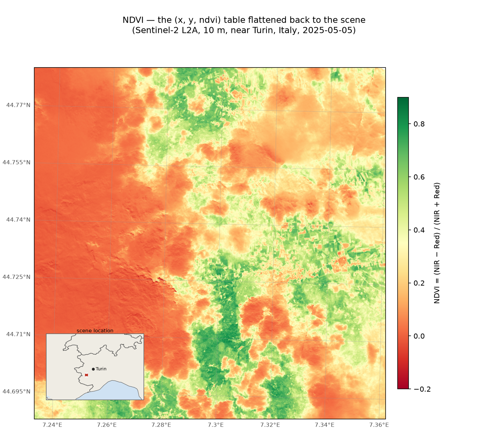
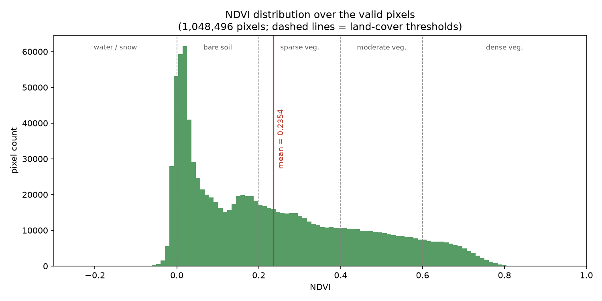
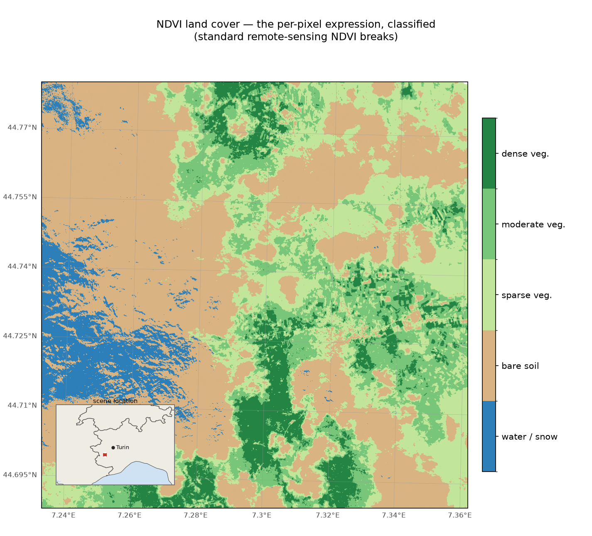

# NDVI cookbook — per-pixel band math via SQL

Computes the **Normalized Difference Vegetation Index** for every pixel of a
Sentinel-2 scene with one SQL expression:

```sql
SELECT x, y, (b08 - b04) / (b08 + b04) AS ndvi   -- (NIR - Red) / (NIR + Red)
FROM scene
ORDER BY y, x;
```

| file | scope | output rows | cost |
|------|-------|------------|------|
| [`ndvi.sql`](ndvi.sql) | 1024×1024 window, 10 m bands | 1024 × 1024 = **1.05 M** | ~8 MB (local sample) |

Adapted from
[xarray-sql's `01_ndvi.py`](https://github.com/xqlsystems/xarray-sql/blob/main/benchmarks/geospatial/01_ndvi.py).

## Why this recipe exists

Every other recipe in this cookbook is an **aggregation** — the payoff is
`GROUP BY … AVG` (see [`../climatology`](../climatology)). NDVI is the
complement: a pure **per-pixel expression** across two co-registered variables.
`b04` (red) and `b08` (NIR) are both 10 m bands on the same `x`/`y` grid, so the
flatten-nD→2D model puts them on the **same rows** and the index reduces to
column arithmetic — no reduction, no rechunk, no join. It's the cleanest possible
demonstration that a Zarr scene *is* a table once you stop thinking in arrays.

The Sentinel-2 scene maps onto the reader's assumptions exactly:

| Zarr array | shape | role |
|---|---|---|
| `x` | `[1024]` | coordinate (UTM easting, m) |
| `y` | `[1024]` | coordinate (UTM northing, m) |
| `b04` | `[1024, 1024]` | data var — red |
| `b08` | `[1024, 1024]` | data var — NIR |

## The data (and why it's local)

`scripts/gen_ndvi_scene.py` resolves the scene **the same way the benchmark
does** — search the [EOPF STAC catalog](https://stac.core.eopf.eodc.eu) for a
`sentinel-2-l2a` item over an agricultural area near Turin, Italy
(2025-04-25 … 2025-05-05), open the `measurements/reflectance/r10m` group, and cut
the 1024×1024 pixel window at `(y=4000, x=6000)` — then writes a tidy 4-array
Zarr locally:

```bash
uv run scripts/gen_ndvi_scene.py     # -> data/s2_ndvi_scene.zarr  (~8 MB)
```

**Why a local sample and not the remote store directly?** The EOPF product can't
be read remotely by this reader, for two independent reasons a spike confirmed:

1. **Pointing at the `r10m` group** forces a directory listing (there's no
   group-level consolidated metadata). The EODC Ceph/S3 endpoint answers a
   listing (`PROPFIND`) with `405 Method Not Allowed`, so the HTTP object-store
   backend can't enumerate the arrays.
2. **Pointing at the product root** *does* read — it has a consolidated
   `.zmetadata` (no listing needed) — but that metadata covers the **whole
   hierarchical product**: 10/20/60 m bands with different shapes and multiple
   `x`/`y`. The reader tries to fold them into one Cartesian coord cube and
   overflows the shape product. It's the mixed-dimensionality conflict from
   `docs/design-decisions.md` §14b, without native V3 `dimension_names` to save it.

Reading the remote store would need reader changes (prefix-filter a consolidated
`.zmetadata` down to one subgroup, or an S3 backend with a custom endpoint +
tenant + anonymous auth) — out of scope for a recipe. The generator sidesteps
both: it reads through xarray (which streams individual chunks by key, no listing)
and lands a clean single-group store.

### Transpose to (x, y) — keeping the coordinates honest

The source bands are laid out `[y, x]`, but the reader assumes **coordinates
sorted alphabetically with data dims in that same order** — i.e. `x` before `y`.
The generator therefore **transposes the bands to `[x, y]`** before writing.
NDVI is symmetric per pixel so the index value is unaffected either way, but the
transpose is what keeps the `x`/`y` **column labels** correct instead of swapped.

## Gotchas

- **NaN nodata.** Bands are CF-scaled reflectance floats with `NaN` where the
  source fill was 0. DataFusion treats `NaN` as **equal to `NaN`** and **greater
  than everything**, so a NaN pixel poisons `MAX`/`AVG` *and* slips past a
  `b04 = b04` test. Filter with `NOT isnan(b08 - b04)` — one test covers both
  bands, since a NaN in either makes the difference NaN. (`ndvi.sql` does this.)
- **Row count is fixed** by the window (`n_x × n_y`), never by the filter — this
  is a projection, not a reduction.

## Run

```bash
zarr-cli cookbook/ndvi/ndvi.sql        # 1.05M rows — redirect to a file
```

## Validating

The reader reproduces xarray's NDVI over the valid pixels **to 4 decimals**:

| metric | value |
|---|---|
| valid pixels | 1,048,496 (80 nodata dropped, 0.008%) |
| NDVI min | −0.2395 |
| NDVI max | 0.8391 |
| NDVI mean | 0.2354 |

Reproduce the summary directly:

```sql
SELECT COUNT(*) AS n,
       ROUND(MIN((b08-b04)/(b08+b04)),4) AS ndvi_min,
       ROUND(MAX((b08-b04)/(b08+b04)),4) AS ndvi_max,
       ROUND(AVG((b08-b04)/(b08+b04)),4) AS ndvi_mean
FROM scene
WHERE NOT isnan(b08 - b04);
```

## Plots

[`plots.py`](plots.py) displays the recipe output — reading the frozen
`ndvi.csv.gz` (the `ndvi.sql` result; regenerate with the `COPY … STORED AS CSV`
shown at the top of the script, then `gzip -9`). The two maps are **georeferenced**:
the raster is drawn on a cartopy GeoAxes in the scene's CRS (UTM zone 32N) with
coastline + country-border features and a **lon/lat graticule**, plus a small
locator inset. The window sits in **Piedmont, NW Italy, near the French/Alpine
border**; no border actually crosses a ~10 km frame (the nearest is the Alpine
crest ~20 km west), so the visible country line lives in the inset while the main
map carries true lon/lat axes. cartopy/pyproj are optional: without them the maps
fall back to plain km axes (no features, no inset).

```bash
uv run --with pandas --with numpy --with matplotlib --with cartopy --with pyproj \
    cookbook/ndvi/plots.py
```

### NDVI raster — the table *is* the scene



The flat `(x, y, ndvi)` table pivoted back into the 2D scene on a red→green
vegetation ramp — the whole point of the recipe: a Zarr scene *is* a table, and
the table *is* the scene. Green agricultural valleys and field parcels, bare/rocky
slopes to the west, and snow on the high peaks (which reads NDVI < 0, same as
water). The inset marks the footprint SW of Turin.

### NDVI distribution



NDVI over the 1,048,496 valid pixels: a bare-soil/snow peak near 0 and a long
vegetation tail out to ~0.8, with the mean (0.2354) and the standard land-cover
thresholds marked.

### NDVI land cover — the per-pixel expression, classified



The same raster binned into land-cover classes (water/snow, bare soil,
sparse/moderate/dense vegetation) at the standard remote-sensing NDVI breaks — the
per-pixel expression turned into a thematic map.

## Writing results to Parquet

No code change needed — wrap the final `SELECT` (drop `ORDER BY` for the write):

```sql
COPY (
  SELECT x, y, ROUND((b08 - b04) / (b08 + b04), 4) AS ndvi
  FROM scene WHERE NOT isnan(b08 - b04)
) TO 'cookbook/ndvi/ndvi.parquet' STORED AS PARQUET;
```
